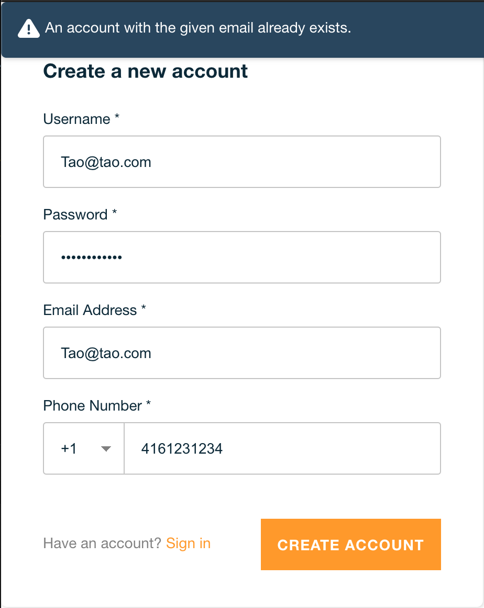

Do this then restart shell
```bash
echo "alias amp='amplify'" >> ~/.bash_profile
```


Userful commands

```bash
npm i

amp init
# just read the instructions
amp add auth
amp add api
# source the schema.graphql in the root
amp push

amp remove <option>

amp delete # only use it when you want to flip the table, Amplify Cli is infested with bugs
```

TO-DO:

prerequisites: Amplify Cli basics

NOTE: Once auth is pushed, update to auth may result in errors for the following. So config excepted attributes before push.

1. Case insensitive 
    > Restric user from creating account like Tao@tao.com and tao@tao.com
    - Amplify CLI does not provide generic config for this. In order to do this, in amplify/backend/auth/{UserPoolName}/{UserPoolName}-cloudformation-template.yml
    add the following to the UserPool properties
    ```
        UsernameConfiguration:
            CaseSensitive: false
    ```
    eg.
    ```
    Resources:
        UserPool:
            Properties:
                ...
                UsernameConfiguration:
                    CaseSensitive: false
                
    ```
    tao@tao.com already exists in the user pool

    

    Source: https://github.com/aws-amplify/amplify-cli/issues/3494 (*monitor this issue, as it might be closed when option added to Amplify Cli)

2. Change password length: (default 8)
    > Apply password policy during sign up
    - There are two ways to do this:
        1. From Amplify CLI, select the following when prompt
        ``` 
            Do you want to use the default authentication and security configuration? - Manual configuration
            .
            .
            .
            Do you want to override the default password policy for this User Pool? - Yes
            Enter the minimum password length for this User Pool: 10
        ```
        2. Directly change config from amplify/backend/auth/{UserPoolName}/parameters.json
        ```
            "passwordPolicyMinLength": "10"
        ```
    
3. Add user to default group on postConfirmation (with Amplify Cli)
    > Add user to a default group, such as "user" group 
    - Configure this part from the CLI
    ```
        Do you want to use the default authentication and security configuration? - Manual configuration
        .
        .
        .
        Do you want to enable any of the following capabilities? - Add User to Group
        ...
        ? Do you want to configure Lambda Triggers for Cognito? - Yes
        ? Which triggers do you want to enable for Cognito - Post Confirmation
        ? What functionality do you want to use for Post Confirmation - Add User To Group
        ? Enter the name of the group to which users will be added. - user
    ```
    Now you able to see a function created for you to add-to-group with post confirmation trigger at amplify/backend/function/{UserPoolName}PostConfirmation/src/add-to-group.js
    The actual trigger is at amplify/backend/function/{UserPoolName}PostConfirmation/function-parameters.json

4. Add admin query for Cognito user pool
    > Allow admin to manage user pool by calling admin query
    - Configure this part from the Cli
    ```
        Do you want to use the default authentication and security configuration? Manual configuration
        .
        .
        .
        Do you want to add an admin queries API? Yes
        ? Do you want to restrict access to the admin queries API to a specific Group Yes
        ? Select the group to restrict access with: admin
        .
        .
        .
    ```
    All the admin query function are added for you.
    (there are some package have security issues, need to fix them)

5. Create step function in Amplify Cli
    WIP...


NOTE: 

-   sometime ```amp push``` does not detect changes, change something in the function (somewhere critical), then ```amp push``` again.
